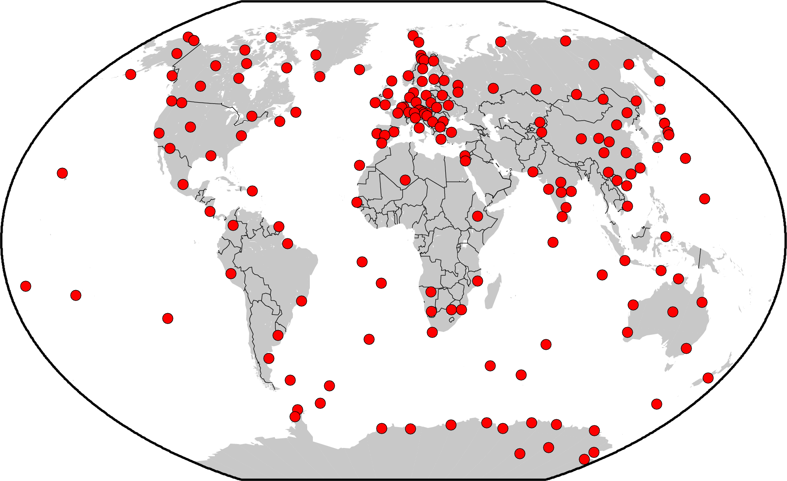

= L'indice G - Geomagnetic Storm Impact
Fabio Fedele <fafed@fabioester.it>
:doctype: article
:description: Una guida alla lettura dell'indice G di NOAA
:stem:

Oltre a pubblicare i dati di numerosi strumenti e a redigere report e previsioni per lo space weather, NOAA ha creato anche tre indici di rapida comprensione collegati ai fenomeni dello space weather. Uno di questi indici è *G* (*Geomagnetic Storm Impact*) ovvero l'effetto di una tempesta geomagnetica sulla terra e sulle attività umane. In questo breve articolo vedremo la cause di queste tempeste, gli effetti che possono causare e come leggere i dati provenienti dagli strumenti scientifici pubblicati online.

== L'origine delle tempeste geomagnetiche

La terra ha un proprio campo magnetico generato dal movimento rotatorio e convettivo di un fluido conduttore al suo interno. Anche il sole ha un campo magnetico analogo che, grazie alla sua grande estensione, arriva ad intergire con quello terreste. A differenza del campo terrestre, quello solare non solo è piuttosto variabile ma può essere localmente influenzato da una serie di fenomeni. L'instabilità del campo magnetico solare va a disturbare quello terrestre, che altrimenti sarebbe molto stabile, dando luogo alle tempeste geomagnetiche nella forma di variazioni di intensità e orientamento delle linee stesse del campo.

// https://www.swpc.noaa.gov/phenomena/geomagnetic-storms

Le tempeste geomagnetiche più grandi sono associate alle *CME* (_Coronal Mass Ejections_). Le CME sono espulsioni massive (miliardi di tonnellate) di plasma che portano con se un proprio campo magnetico che va a disturbare quello terrestre. Dal verificarsi della CME alla tempesta geomagnetica può passare da meno di un gorno ad alcuni giorni a seconda della velocità impressa al plasma. Il normale flusso di vento solare proveniente dal sole viene quindi potenziato notevolmente dalle _CME_, ma a questo si aggiunge il disturbo sulla magnetosfera operato dai campi magnetici intrappolati al suo interno.

Le tempeste geomagnetiche minori possono essere generate anche dagli *HSS* (_High Speed Solar Wind Stream_). Anche in questo caso abbiamo un variazione nel vento solare generato dalla combinazione del normale vento  con un flusso aggiuntivo ad alta velocità che comprime il plasma aumentandone la densità creando le *CIR* (_Corotating interaction regions_). Queste regioni ruotano insieme al campo magnetico solare (_corotating_) e individuano le zone dove i venti solari a velocità differenti interagiscono (_interacting regions_). Quando la terra attraversa le _CIR_ il suo campo magnetico viene disturbato. A differenza delle _CME_ l'intensità del disturbo è minore, ma nel tempo riescono a trasferire anche quantità maggiori di energia.

.L'ultima immagine prodotta attraverso il modello predittivo Wang-Sheeley-Arge (WSA)-Enlil. La predizione utilizza i dati raccolti dai satelliti STEREO A e B e da sensori a terra. I dati vengono poi elaborati da un modello matematico. L'immagine mostra la densità del plasma (in alto) e la velocità del vento solare (in basso)
image::https://services.swpc.noaa.gov/images/animations/enlil/latest.jpg[]

// https://www.swpc.noaa.gov/products/wsa-enlil-solar-wind-prediction

Anche le correnti intense nella magnetosfera, variazioni della ionosfera che influiscono sulla termosfera creano disturbi geomagnetici. Ci sono poi le correnti che girano intorno al nostro pianeta in direzione ovest che creano disturbi. Queste correnti hanno anche un indice specifico chiamato *Dst* (_Disturbance storm time_). Infine ci sono le correnti che seguono i campi magnetici (_field aligned currents_) che poi si collegano alle correnti nella ionosfera delle aurore chiamate _auroral electrojets_. Il risultato combinato di tutti questi disturbi al campo magnetico a terra viene tradotto nell'indice *Kp* che è la base dell'indice *G*. A breve vedremo come viene calcolato questo indice.

== Quali sono gli effetti delle tempeste geomagnetiche?

Le tempeste geomangnetiche non hanno alcun impatto sulla vita sulla terra, se non regalare a coloro che vivono nelle aree polari degli stupendi spettacoli legati alle aurore boreali. Purtroppo però, molti manufatti umani, soprattutto quelli di più recente costruzione, sono estremamente sensibili a questi fenomeni. Il riscaldamento dell'atmosfera dovuto all'arrivo di queste particelle con maggiore energia aumenta la densità dell'atmosfera a livello dell'orbita bassa (tra i 300 e i 1000 km) frenando i satelliti come quelli del GPS. Questi stessi satelliti possono anche subire l'alterazione dei parcorsi dei segnali radio con conseguenti errori nel calcolo della posizione. Anche le condutture elettriche e le lunghe linee ad alta tensione possono essere attraversate e danneggiate da correnti indotte dalle variazioni del campo magnetico (_GIC - Geomagnetic Induced Currents_).

// http://www.physics.usyd.edu.au/~cairns/teaching/lecture11/node4.html

== Gli strumenti di osservazione

Come abbiamo visto le misure del disturbo del campo magnetico terrestre viene fatto a terra. Sulla superficie terrestre sono disseminati una serie di ossevatori che misurano costantemente il campo mangnetico e le sue variazioni. Punto di riferimento per questa ricerca in Europa è il  *GFZ* (_Helmholtz-Zentrum Potsdam – Deutsches GeoForschungsZentrum_, Centro di Ricerca tedesco per le Geoscienze) ed in particolare il https://www.gfz-potsdam.de/en/section/geomagnetism/data-products-services/geomagnetic-kp-index[gruppo che si occupa dell'indice Kp]. Gli osservatori dai quali viene derivato l'indice Kp appartengono alla rete https://imag-data.bgs.ac.uk/GIN/[INTERMAGNET] coordinata dal https://www.bgs.ac.uk/[_British Geological Service_]:

.Distribuzione degli osservatori geomagnetici (_British Geological Service_)
 

Per effettuare le misure vengono utilizzati i _magnetometri_. Il tipo più comune è il _fluxgate_. E' uno strumento abbastanza semplice ed economico che tuttavia consente di rilevare variazioni del campo nell'ordine dei nanotesla. Per calcolare l'intensità del campo magnetico sfrutta la saturazione di un nucleo di materiale ad alta permeabilità magnetica. Per la sua particolare sensibilità alla temperatura viene installato in siti sotterranei a temperatura costante.

.Principio di funzionamento di un magnetometro fluxgate
video::3IAR5UGSAIg[youtube]

== Il calcolo dell'indice Kp

Il campo magnetico terrestre, in assenza di disturbi, non ha un valore costante su tutto il pianeta e di modifica con il tempo ed attualmente va dai 5000 nT delle zone polari ai 40000 nT del sud-est asiatico. Anche l'effetto dei disturbi del campo geomagnetico sono differenti a seconda della posizione e dell'osservatorio e, dato che l'indice Kp va a evidenziare le sole variazioni di questo campo, è necessario normalizzare i valori in modo tale che i dati registrati dai singoli osservatori possano essere usati correttamente. Questo viene effettuato attraverso delle tavole di conversione calcolate specificamente per ogni osservatorio.

.Intensità del campo magnetico orizzontale (H) sulla superficie terrestre nel 2020
image::intensita_campo_magnetico.png[] 

